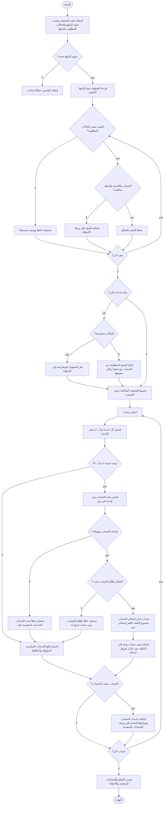
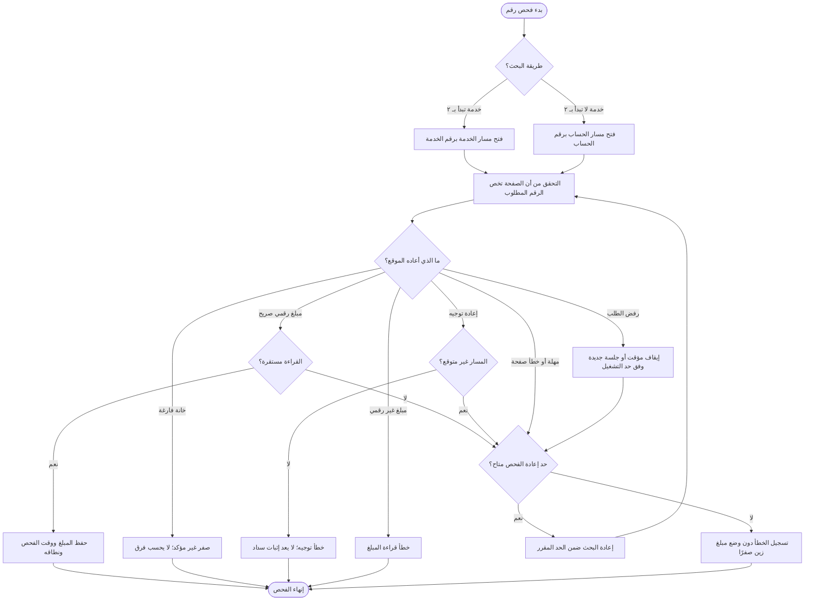
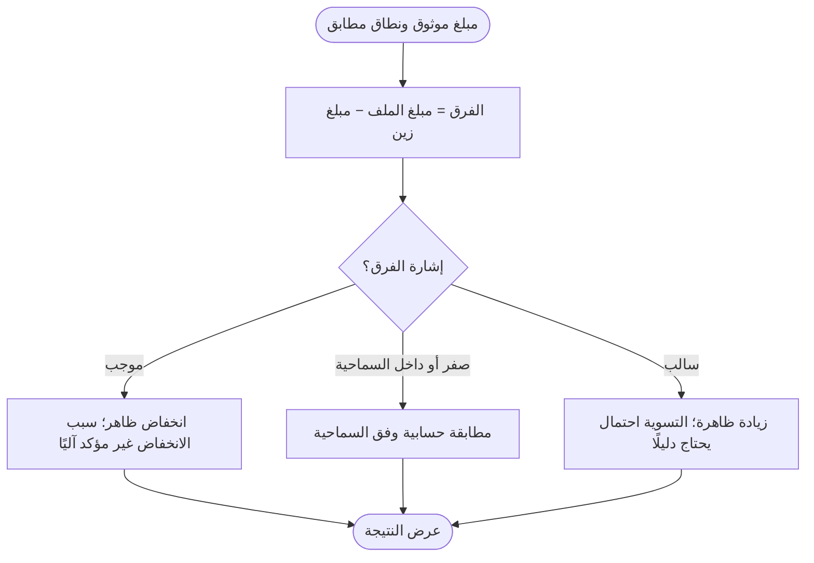

# مخطط تدفق فحص زين

## ١. معالجة ملف المحصل

## ٢. فحص زين ومعالجة الاستثناءات

## ٣. معنى النتيجة وحدودها

**قاعدة الحساب المتعدد:** إجمالي الحساب يخص كل خدماته في زين. لا يُنسب مبلغ الإجمالي إلى خدمة بعينها، ولا يُطرح منه مبلغ خدمة مفحوصة لاستنتاج مبلغ خدمة أخرى، ولا يُضاف فرق الخدمة إلى فرق الحساب.
